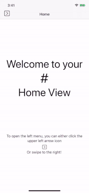
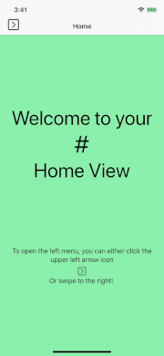
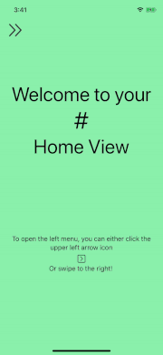

# CDSideMenu
> An elegant side menu for you app, made with love and SwiftUI.

CDSideMenu is a highly customizable side menu library created for fun, for you apps. 

  

## Features

- [x] An animated Side Menu with your own menu item
- [x] A high level of configuration to fit your app design
- [x] 3 pre-configured styles for your convenience
- [x] A verbose configurator to let you know if your current configuration is right, or not
- [x] An observable UserData class model that you can extend to add your own properties
- [x] A list of example views to illustrate the usage of this library

## Coming soon features

- [ ] Side menu opening alignment (left, right)
- [ ] Landscape mode
- [ ] CocoaPods integration

## Customizable properties

- navigationBarHidden: *Will hide the navigationBar. If hidden, a open/close button will be added*
- accountViewHidden: *Will hide the side menu account view, containing the user profile picture, the username, the account and logout buttons: The side menu backgroundColor*
- menuBackgroundColor: *The side menu backgroundColor*
- menuForegroundColor: *The side menu texts and SF images color*
- viewsBackgroundColor: *The content views' backgroundColor*
- menuFont: *The side menu texts font*
- menuButtonSize: *The open/close menu button size*
- menuSizeFactor: *The menu size factor, 1 being half screen size*
- openedMenuButtonSFImage: *The SF image used as the opened side menu button icon*
- closedMenuButtonSFImage: *The SF image used as the closed side menu button icon*
- menuItems: *The list of items to display in the side menu*
- userData: *The ObservableObject user account data, optional*

## Requirements

- iOS 13 or above
- Swift 5.2
- Xcode 11.4

## Installation

At the moment, the library is only available though Github. A Pod will arrive later.

#### Git

You can use [Git](https://git-scm.com/) to clone `CDSideMenu` and its example project:

```git
git clone https://github.com/christophedellac/CDSideMenu
```

#### Manually

1. Download and drop the `CDSideMenuSrc` (CDSideMenu/CDSideMenuSrc) folder in your project.  
2. Congratulations!  

## Usage

To get the full benefits of `CDSideMenu`, don't forget to check out the CDSideMenuExample XCode project. 

After adding the source folder into your project, you can start using `CDSideMenu` by following those 2 steps:

- [x] **Step 1: configure your `CDSideMenu` by creating your views and a CDSideMenuConfiguration object. Add your menu items and specific configuration to it. Refer to the example that you can find in the ContentView.swift file in the example project.**

- [x] **Step 2: create a NavigationLink to `CDSideMenuMainView`, which will become your main view, containing your menu items and the side menu.**

``` swift
NavigationLink(destination: CDSideMenuMainView()
                    .environmentObject(createConfiguration()), label: {
                        Text("Now, click here ;) ")
                            .font(.system(.subheadline, design: .monospaced))
                })
```

## License

`CDSideMenu` has no ``LICENSE``. Feel free to use, modify this library as you wish, and do not forget to share your opinion :)

## Meta

Christophe Dellac - [https://github.com/christophedellac/](https://github.com/christophedellac)
CDSideMenu - [https://github.com/christophedellac/CDSideMenu](https://github.com/christophedellac/CDSideMenu)
